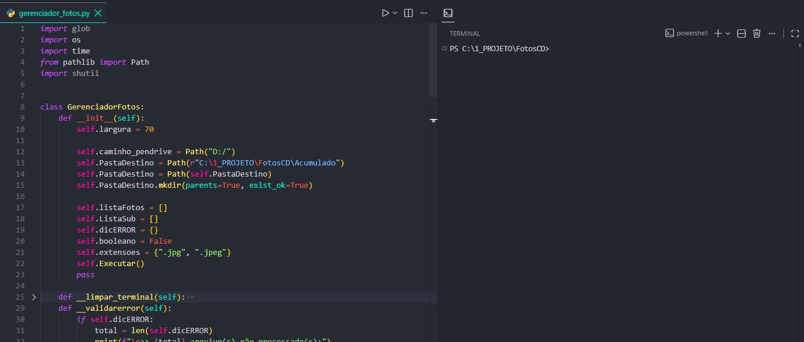

<h1 align="center"> </h1>

<table align="center">
<tr>
<!-- Lado Esquerdo: Frase, Links e Badges -->
<td align="center" valign="middle">
    <p>Gerenciador e Extrator de Fotos Antigas (CD to Local/Drive)</p>
    <h3>"Deixe o robô trabalhar enquanto você toma um café."</h3>
    <h2>
        <a href="https://www.linkedin.com/in/wesley-henrique22" target="_blank" rel="noopener noreferrer">LinkedIn</a> |
        <a href="https://github.com/wesley-henrique1" target="_blank" rel="noopener noreferrer">GitHub</a> | 
        <a href="https://www.bing.com/search?q=aqui%20estou%20devendo%20link&qs=n&form=QBRE&sp=-1&ghc=1&lq=0&pq=aqui%20estou%20devendo%20link&sc=12-23&sk=&cvid=989C403393164B4298A65FE780076F4B" target="_blank" rel="noopener noreferrer">Instagram</a>
    </h2>
    <p align="center">
        
        
    </p>
</td>
<!-- Lado Direito: Imagem Principal -->
<td align="center" valign="middle" width="300">
    
</td>
</tr>
</table>

---

### 📌 Contexto & Motivação
Mídias ópticas antigas sofrem degradação natural ao longo do tempo (disc rot, arranhões e poeira). Ao tentar transferir manualmente o conteúdo de 6 CDs de fotos para um pendrive/disco local pelo File Explorer do Windows, a leitura de setores danificados causava travamentos congelantes na interface do sistema operacional e cancelava todo o processo de cópia.

A urgência de digitalizar esses arquivos antes da perda definitiva das fotos levou à criação desta solução automatizada em Python.

---

### ⚡ Solução Automatizada

O script **`GerenciadorFotos`** atua de forma resiliente para extrair as mídias minimizando o impacto no sistema:

- 🔍 **Mapeamento Recursivo:** Varre diretórios e subpastas na mídia de origem.
- 🖼️ **Filtro de Extensões:** Identifica e seleciona formatos válidos de imagem (ex: `.jpg`, `.jpeg`).
- 🚚 **Cópia e Padronização:** Move e renomeia os arquivos para a pasta de destino do projeto para manter a organização.
- 🛡️ **Tratamento de Exceções:** Falhas em arquivos corrompidos/arranhados são isoladas sem congelar a aplicação ou o sistema operacional.
- 📝 **Registro de Erros (Logs):** Mapeia os arquivos que falharam durante a leitura no dicionário `dicERROR` para posterior verificação.

<div align="center">
  
  <br><br>
  <video src="img/demonstracao.mp4" width="600" controls poster="img/amostra.png">
    Seu navegador não suporta a exibição deste vídeo.
  </video>
</div>

---
### 🛠️ Tecnologias e Módulos

O projeto utiliza puramente a biblioteca padrão do Python, dispensando instalações adicionais:

| Módulo | Finalidade |
| :--- | :--- |
| **`pathlib` / `os` / `glob`** | Mapeamento, busca recursiva e manipulação eficiente do sistema de arquivos |
| **`shutil`** | Operações de cópia e transferência de alta performance |
| **`time`** | Controle de intervalo e gerenciamento de retentativas de leitura |
## 📁 Estrutura do Projeto

```text
├── 📁 Acumulado
├── 📁 img
│   ├── 🖼️ FleshPerfil.png
│   ├── 🖼️ amostra.png
│   └── 🎬 demonstracao.mp4
├── ⚙️ .gitignore
├── 📄 LICENSE
├── 📝 README.md
└── 🐍 gerenciador_fotos.py
```

---